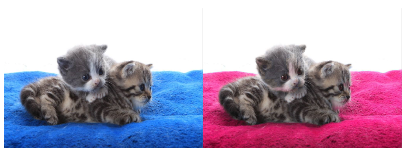
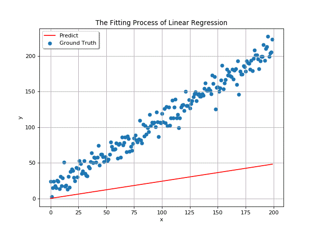
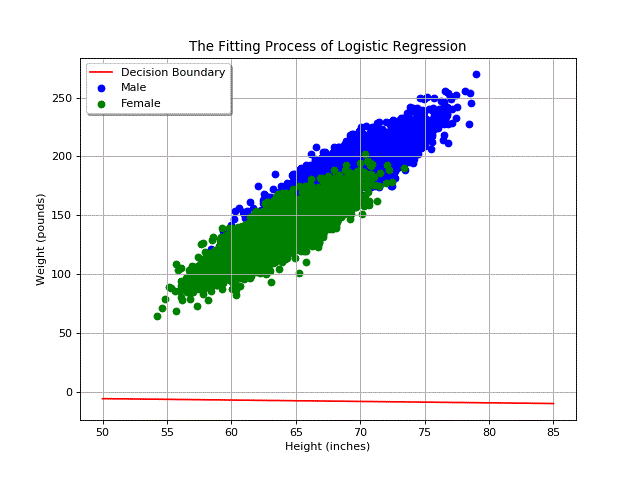
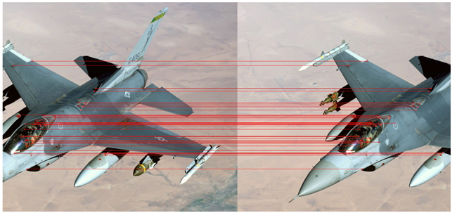
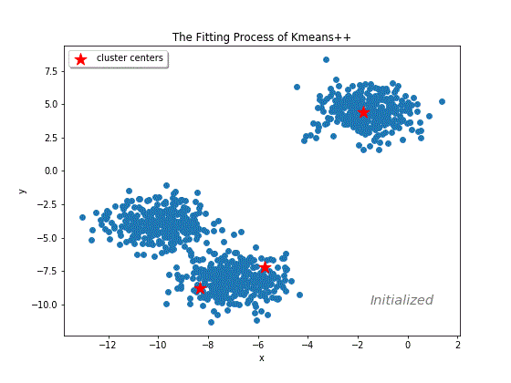

# CVLearning

本仓库记录了学习计算机视觉的作业与相关思考。每周都分成两个部分，理论要点和编程实践。

## week1

#### 理论要点

图像几何变换主要包括：

（1）Translation: (x, y) -> (x+a, y+b)。

（2）Scale: (x, y) -> (ax, by)， 且a>0, b>0；当 a, b 相等时为uniform scale；当a, b中有一个大于0时，为Reflection。

（3）Rotation: (x, y) -> (xcos(θ)+ysin(θ), -xsin(θ)+ycos(θ)). 注意这是绕坐标系原点的旋转。绕任意点旋转需要		  和与Translation结合。

（4）Shear: (x, y) -> (x+ay, y+bx)。

（5）Rigid transformation(具有 distance preserving，即变换前后两点的距离不变): translation + rotation

（6）Similarity transformation(具有 angle preserving, 即变换前后两直线形成的夹角相同): 

​		  translation + rotation + uniform scale

（7）Affine transformation(具有 parallelism preserving, 即平行线变换前后保持平行):

​		  translation + rotation + scale + shear

（8）Pespective transformation(具有 linear preserving, 即直线变换前后还是直线)。

以上几何变换的关系为：

Rigid transformation ⊂ Similarity transformation ⊂ Affine transformation ⊂ Pespective transformation

#### 编程实践

（1）基于OpencV的图像处理的[基本操作](./week1/basic_operations.ipynb)。包括色彩空间变换，仿射与投影变换，直方图均衡化，图像腐蚀与膨胀等。

（2）基于OpenCV的[图像增强](./week1/image_augmentation.py)操作，包括图像剪切(crop)，旋转(rotation)与仿射变换等。

（3）[改变图像背景色](./week1/change_background.py)的demo：

其中关键步骤为色域转换，即从RGB色彩空间转换为 HSV 空间，然后做腐蚀膨胀处理。

## Week2

#### 理论要点

opencv的图像滤波，实际上就是图像和卷积核做卷积，它和深度学习中的图像卷积**差异**有以下几点：

（1）卷积核是2D（单通道的），如果将卷积核作用于一个3D图像，那么会分别在图像的每个通道上独立的做相同的卷积，这意味着输入图像的通道数和输出的相等；而深度学习中的卷积核为3D的，它的通道数等于输入tensor的通道数。

（2）进行卷积前后，输入图像和输出图像的宽度、高度也都相同，也就是说，opecv的滤波函数会根据卷积核的大小，自动地调整padding的大小，使得宽高相等；而深度学习中，输入tensor和输出tensor的宽度和高度可以不同。

（3）卷积核中有一个所谓的[锚点](https://docs.opencv.org/2.4/modules/imgproc/doc/filtering.html#filter2d)(anchor point)，该锚点指原图像中进行滤波的像素点在卷积核中的相对位置，通常为卷积核的正中心（这也是卷积核长宽为什么为奇数的主要原因，因为奇数才有正中心）；但是深度学习中该概念并不明显。

（4）深度学习中的paddding一般只有一种（补0），但opencv中的padding有许多种，主要包括：

| Border types       | 示例                      | 说明                     |
| ------------------ | ------------------------- | ------------------------ |
| BORDER_REPLICATE   | aaaaaa\|abcdefgh\|hhhhhhh | 重复边界元素             |
| BORDER_REFLECT     | fedcba\|abcdefgh\|hgfedcb | 边界镜像（含边界元素）   |
| BORDER_REFLECT_101 | gfedcb\|abcdefgh\|gfedcba | 边界镜像（不含边界元素） |
| BORDER_CONSTANT    | iiiiii\|abcdefgh\|iiiiiii | 指定常数                 |

BORDER_REPLICATE是opecv中值滤波函数medianBlur采用的默认方式。BORDER_REFLECT与BORDER_REFLECT_101一般差异很小，只有在卷积核尺度接近图像尺度时差异才较大。BORDER_REFLECT_101应用十分广泛，是滤波函数filter2D，blur，GaussianBlur，bilateralFilter的默认处理方式。BORDER_CONSTANT常用于仿射变换与透视变换中。

卷积的物理意义主要有两点：

（1）对图像的像素值在空间范围上求导，例如prewith和sobel算子（体现一阶导数信息）和laplacian算子（体现二阶导数信息）。

（2）对图像的像素值按照卷积核进行加权平均，例如高斯滤波。

待补充Hog算法。

#### 编程实践

基于numpy和OpenCV的[中值滤波](./week2/median_blur.py)算法。该算法运行时间远比OpenCV内置的中值滤波算法时间长，待定位。

## Week3

#### 理论要点

Linear regression有解析解和数值解。解析解通过最小二乘法，数值解通过梯度下降的方法获得。解析解是完美的全局最优解，但它有两个问题：

（1）不适合海量数据的场景；

（2）不适合非凸的目标函数。实际场景几乎都是非凸的目标函数。

不同属性（特征）的scale差距过大，会使得训练过程中大大偏离局部最优解的方向，从而训练慢。此时应该做归一化，避免该现象。

随机梯度下降：它不同于梯度下降（每次都沿着全部数据代表的全局梯度的方向下降），而通过部分采样的方式引入了随机性。

对于凸的目标函数，参数（权重，偏置）的初始值并不重要，但是它对于非凸的目标函数很重要。

#### 编程实践

（1）基于numpy的[线性回归](./week3/linear_regression.py)算法及其可视化。训练动态图如下：

（2）基于numpy的[逻辑回归](./week3/logistic_regression.py)算法及其可视化。训练动态图如下：

这个数据集不是人造的，而是Kaggle提供的[数据集](https://www.kaggle.com/mustafaali96/weight-height)。可以看出两类数据点的重合部分较大。

## week4

#### 理论要点

待补充SIFT算法。

#### 编程实践（Project 1)

基于OpenCV实现了[图像拼接](./week4/image_stitching.py)。拼接的两张原图为：

匹配点为：

拼接合成图：

## week5

#### 理论要点

（1）SVM是基于最大化最小间隔的原则进行分类。二分类的SVM的label分成两类-1，和+1，但是logistic回归的label两类却是0和1。实际上，两者（线性可分的svm）的决策边界都是wx+b=0，但是logistic回归将其取了个sigmoid，映射成0~1（因此具有概率含义）。

经过数学推导，线性可分的svm最终变成了有不等式约束条件下的最优化问题（机器学习问题的数学形式其实就是最优化问题），最优化的是使得权重w的模最小。但实际的数据肯定不是线性可分的，因此引入了软间隔和核函数。

SVM并不适合大量数据，因为它的计算时间复杂度大（O(N^2))，而且要读入全部样本，很消耗内存。但是logistic回归可以，因为它能够用mini-batch的梯度下降的方法来优化，即一次只处理一小批的内容。

（2）softmax可以理解为一种激活函数，和sigmoid/relu等单输入单输出不同的是，它的输入有多个。它会使得小的更小，大的更大（指相对比例）。例如softmax([2, 3, 4]) = [0.09, 0.24, 0.69]；另外，直接用公式算softmax的话，很有可能会溢出（numpy会输出inf，再做运算会变成nan）。

（3）kmeans的主要问题包括：k值的选择和容易陷入不好的局部最优解。

k值的选择是一个超参数，一种常见的方式是Elbow method。即通过取一系列的k值，然后人工评估不同k值的WSS(每一簇样本与其聚类中心的平方和的总和)，然后人为地找出拐点，YoloV3就是这么做的。但是拐点的判断是比较主观的。也有程序自动调整k值的算法，例如ISODATA。

kmeans找的是局部最优，而且它容易陷入不好的局部最优解。例如，有四个样本点，坐标为(0, 0), (2, 0), (0, 1)和(2, 1)。现在要聚成两类，如果初始的聚类中心是(1, 0), (1,1)，那么就直接收敛了，但实际上(0, 0.5)和(2, 0.5)才是最优解。从上面可以看出，找到一个好的局部最优解和初始值密切相关。

对于上述初始值问题，一种解决方式是多次尝试不同的初始聚类中心。sklearn库的kmeans的构造函数专门有一个入参n_init，用来配置多个不同随机种子下的初始聚类中心，然后选择其中指标最好的一组聚类中心。

另一个解决方式是改善初始化方法，代表算法为kmeans++。原生的kmeans算法的初始选择十分简单，就是直接在样本中随机选择k个点作为初始的聚类中心。但是这样很有可能选择的聚类中心彼此距离很近，这和类间远距离，类内近距离的聚类思想不符，而kmeans++正是改善（也仅仅改善）了这一点，许多库（例如sklearn）的默认初始化方式就是kmeans++。

kmeans++的初始化方法步骤为：

1. 按照均匀分布，从数据点x选择一个点作为第一个聚类中心；
2. 对于每一个数据点x，计算D(x)，即它到最近的已经选出来的聚类中心的距离；
3. 根据D(x)^2的概率分布，随机选择出下一个数据点作为聚类中心。这意味着，D(x)越大的数据点越容易被选中；
4. 重复步骤2和步骤3，直到选出k个聚类中心为止。

#### 编程实践

基于numpy的[kmeans++](./week5/kmeans_plus_plus.py)算法与可视化。训练动态图如下：

其中的数据是人为造的，具有明显的聚类结构。可见kmeans++对于这种结构化数据，收敛得很快。

## Week 7

#### 理论要点

本周总结了若干经典的网络：

[ResNet分析](week7/ResNet.md)