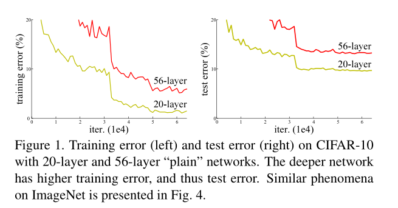
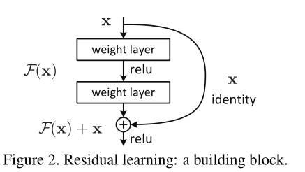
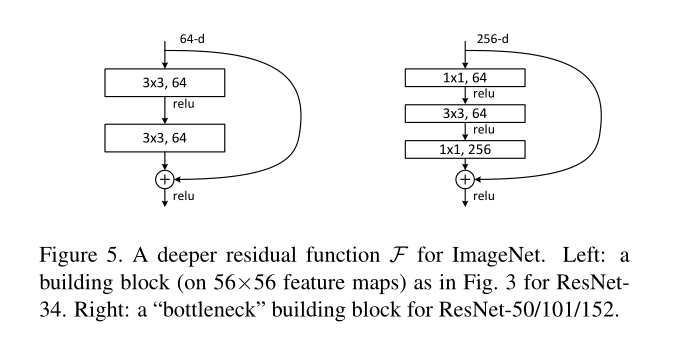

# ResNet分析(2015)

## 1 背景

随着网络结构的加深，在许多数据集上都会出现”退化“(degradation)现象，也就是深层网络的效果反而比不上浅层网络，如下图：

注意，这并不是过拟合。过拟合是指训练集表现好，而测试集表现差；而在退化现象中，深层网络在训练集上都比不过浅层网络。这显然不正常，因为深层模型有着更强的表达能力。如果深层模型后面都是恒等映射，那么在训练集上的效果也不会比浅层模型的差。

这是不是由梯度弥散(vanishing gradient)引起的呢？许多人认为就是因为梯度弥散。但是，作者在论文中表明，这应该不是梯度弥散的原因。有两点理由：1）首先网络已经加了BN层，作者也观察了反传梯度是正常的；2）将训练的时间增加3倍，退化现象依然存在。因此作者认为，这可能是因为深层网络具有"exponentially low convergence rates"，具体还需进一步研究。我将其理解为深层网络难以训练，或者说难以收敛到一个比较好的极小值。

## 2 核心思想

### 2.1 残差网络

针对退化现象，论文作者提出了ResNet的网络结构，即输入多了一层直接连接(skip-connection)层，它和原本的输入进行element-wise的相加：

图中的加法意味着F(x)和x在宽度，高度和通道数都是一致的。如果不一样，如何解决呢？

（1）针对宽高不一致(F(x)有可能比x的宽和高更小），采取stride=2进行选择；

（2）针对通道数不一致(F(x)有可能比x的通道数更大），有两种方式。第一种是对通道进行zero-padding；第二种是采用1*1的卷积核(此时称为projection shortcut)。实验表明，1\*1的卷积核效果更好，因为它增加了参数与模型表达能力。

这种结构，意味着F(x)学习到的是残差，也是ResNet名称的由来。

### 2.2 瓶颈(Bottleneck)结构

残差结构可以解决退化问题，但是无法解决当网络结构很深时的训练慢问题，因为模型越深，参数量越大，计算量越大。Bottleneck结构能显著减少模型参数量，同时不降低太多的模型表达能力，从而缓解了这一问题。基本思想是，在原本的两层3*3卷积层中，插入1\*1的卷积层，使得通道数先减小，再增大，类似一个瓶颈结构。

## 3 总结

ResNet的提出是CNN的里程碑事件，在2015年获得了5项比赛第一，影响深远，至今依然被使用。

14年的VGG只能达到19层，而15年的ResNet达到了152层（甚至1000多层也能取得不错的效果），说明残差结构基本上解决了退化问题。

值得注意的是，虽然ResNet层数远比VGG的多，但是它的FLOPs却更小。VGG19约为200亿FLOPs，ResNet50为36亿FLOPs，ResNet101约为100亿FLOPs。主要原因在于ResNet的卷积层输出的通道数设计的较小，从而大大减少了卷积层的计算量。

